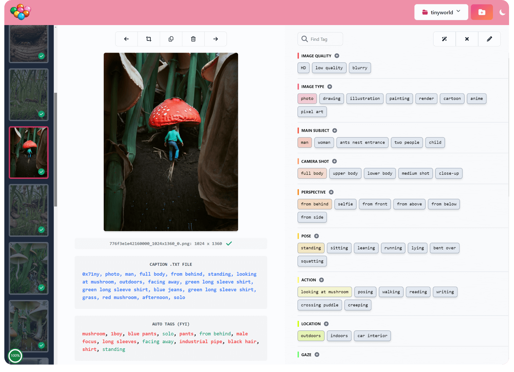
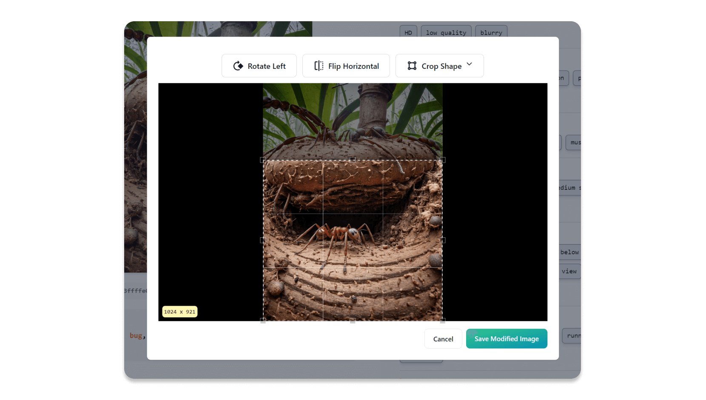

# Candy Machine - Manual Image Tagger

_Web-Based Manual Image Tagger for Training Custom Stable Diffusion LORAs & DreamBooth Models_

<picture>
  <source media="(prefers-color-scheme: dark)" srcset="assets/candy-machine-dark.png">
  <source media="(prefers-color-scheme: light)" srcset="assets/candy-machine.png">
  
</picture>

Candy Machine is a nascent image tagger for _manually tagging_ small datasets (< 1k images) with `.txt` caption files:

- **Customizable tag layout** for consistent tagging

- **Placeholder tag templates**: i.e. `{type} clothes`, where `{type}` can be specified when adding a tag

- **In-built image editing** (crop, rotate and flip horizontal)

- **Tag suggestions** using `wd-v1-4-convnext-tagger.v3` when creating a new project

- **Automatic file conversion** to .png from .webp, .avif, .gif, etc

- **Progress % pie chart** - for those times when you wonder _'am I done yet?!'_

- **Keyboard shortcuts** - press '?' for a list

- and more coming soon!

Candy Machine runs entirely on your local machine in "single player" mode. No information is transmitted to any
3rd party system.

## Built-In Image Editor

<picture>
  <source media="(prefers-color-scheme: dark)" srcset="assets/image-editor-dark.png">
  <source media="(prefers-color-scheme: light)" srcset="assets/image-editor.png">
  
</picture>

## Why?

I was inspired by [this Reddit post](https://www.reddit.com/r/StableDiffusion/comments/118spz6/captioning_datasets_for_training_purposes/) about how to best tag small image datasets, focusing mainly on consistency.

I've also never loved the "fiddly" parts of building a dataset - converting images, renaming them, cropping etc. I want to make building datasets quick, easy and, who knows, maybe even fun!

H/T to [BinaryAlley](https://github.com/BinaryAlley/DatasetTag) also for their prototype.

## Requirements:

- Git
- Python 3

## Free for Personal, Non-Commercial Use.

This software is entirely free for personal, non-commercial use. If you're using it in a business context or for commercial use
(i.e. to make money from it), please contact me to arrange a paid license. This will help support my development costs.

## How to Run on Windows

```console
git clone git@github.com:mikeknapp/candy-machine.git
cd candy-machine
run
```

A browser window should automatically open: `http://127.0.0.1:5000/`

## How to Run on MacOS/Unix

(Note, I haven't tested this yet, there may be bugs!)

```console
git clone git@github.com:mikeknapp/candy-machine.git
cd candy-machine
chmod +x run.sh
./run.sh
```

A browser window should automatically open: `http://127.0.0.1:5000/`

## Using the GPU for Image Tagging

Requires CUDA 12.2 and cuDNN8.x.

1. Activate the Python venv. (Look inside run.bat for clues on how to do that.)

2. Install `onnxruntime-gpu`

```console
pip install onnxruntime-gpu --extra-index-url \
    https://aiinfra.pkgs.visualstudio.com/PublicPackages/_packaging/onnxruntime-cuda-12/pypi/simple/
```

## Known Issues

- Can't edit a project's tag layout or the default tag layout inside the app. (Workaround: edit `default_categories.json` in the server directory, or a project's `categories.json`. For the latter, be sure not to remove tags that are being actively used, otherwise they will be orphaned at the end of the tag list if you save that image in the future.)

- Can't add more images to a project! (Workaround: create a new project. I know, not ideal.)

- Can't edit the trigger word / synonyms. (Workaround: edit the project's `config.json` and all existing .txt caption files.)

## Feature Pipeline

- Delete tags
- Sort tags by usage
- Add more images!
- Edit trigger word / synonyms
- Image zoom
- Color picker -> color name
- Find and replace tags (across the project)
- Export wizard to prepare the data and generate recommended settings for [Kohya SS](https://github.com/bmaltais/kohya_ss)
- Customize tag layout from import analysis
- Saved presets for tag layouts (i.e. photography, anime, style LORAs etc)
- Watermark removal (inpainting?)
- Detection and removal of [Nightshade-poisoned images](https://nightshade.cs.uchicago.edu/whatis.html#) etc from the dataset (to respect the wishes of copyright holders and protect your dataset).
- Maybe in the future: Automated image search to find more images?

## Want to Contribute?

Tech stack:

- Basic Python HTTP server - using virtual env
- Parcel for building the JS and CSS bundles
- TypeScript
- Flowbite React for the UI components
- Tailwind CSS for styling

Before spending any time writing code, please open an issue with your proposal so we can discuss. Thanks!

### Virtual Env Setup (Windows):

```console
python -m venv venv
call .\venv\Scripts\activate
pip install -r requirements.txt
```

### Run the UI:

Prerequisites: Node and Yarn.

```console
cd ui
yarn start
```

### Run the Server:

```console
cd server
python main.py
```

## Questions, Comments, Feedback?

Please send me a message, or open an issue. Thanks!
