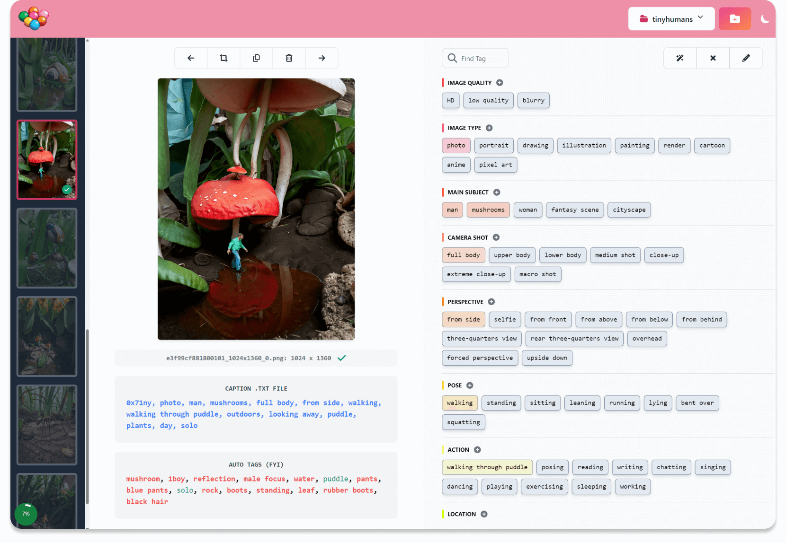
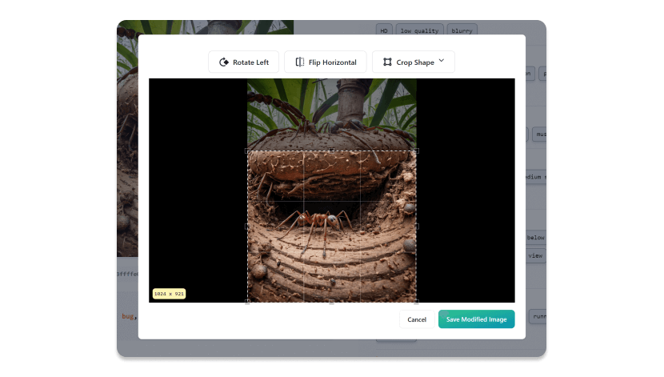

# Candy Machine - Image Dataset Tagger

For Stable Diffusion / Lora / DreamBooth Training



Candy Machine is a nascent image tagger for creating Dreambooth models or LORAs for the Stable Diffusion ecosystem:

- Automatic file conversion to .png from .jpg, .gif, .webp and more
- Automatic tag analysis using wd14-convnextv2.v1
- Customizable tag layout, for consistent tagging
- Basic image editing (crop, rotate and flip horizontal)
- More features coming soon!

Candy Machine runs locally on your machine, and no information is transmitted to a third party server.

## Built-In Image Editor



## Why?

I was inspired by [this Reddit post](https://www.reddit.com/r/StableDiffusion/comments/118spz6/captioning_datasets_for_training_purposes/) about how to best tag image datasets. (H/T also to [BinaryAlley](https://github.com/BinaryAlley/DatasetTag). I liked your prototype, but wanted to create my own take.)

I also have never loved the "fiddly" parts of building a dataset - converting images, renaming them, etc. I want to make building datasets quick and easy, maybe even fun!

## Requirements:

- Git
- Python 3

## Free for Personal, Non-Commercial Use.

This software is entirely free for personal, non-commercial use. If you're using it in a
business context or for commercial use (i.e. to make money from it), please contact me to arrange a license. This will help support my development costs.

## How to Run on Windows

```powershell
git clone git@github.com:mikeknapp/candy-machine.git
cd candy-machine
run
```

A browser window should automatically open: `http://127.0.0.1:5000/`

## How to Run on MacOS/Unix

(Note, I haven't tested this yet, there may be bugs!)

```sh
git clone git@github.com:mikeknapp/candy-machine.git
cd candy-machine
chmod +x run.sh
./run.sh
```

A browser window should automatically open: `http://127.0.0.1:5000/`

## Running Image Tagger on GPU

Requires CUDA 12.2 and cuDNN8.x.

Step 1: Activated the Python venv. (Look inside run.bat for clues on how to do that.)

Step 2: Install `onnxruntime-gpu`

```sh
pip install onnxruntime-gpu --extra-index-url \
    https://aiinfra.pkgs.visualstudio.com/PublicPackages/_packaging/onnxruntime-cuda-12/pypi/simple/
```

## Known Issues

- It's currently quite **annoying to search for tags**, and **tags quickly get messy**. (I'll fix it soon!)
- **Can't edit a project's tag layout** or the default tag layout (Workaround: edit `default_categories.json`
  in the server directory, or a project's `categories.json`. For the latter, be sure not to remove tags
  that are being actively used, otherwise they will be orphaned at the end of the tag list if you save that image in the future.)
- **Can't add more images to a project!** (Workaround: create a new project. Not ideal, I know.)
- **Can't edit the trigger word / synonyms**. (Workaround: edit the project's `config.json` and
  all existing .txt caption files.)

## Feature Pipeline

- Delete tags
- Sort tags by usage, hide uncommon tags
- Add more images!
- Edit trigger word / synonyms
- Image zoom
- Color picker -> color name
- Find and replace tags (across the project)
- Export wizard to prepare the data and generate recommended settings for [Kohya SS](https://github.com/bmaltais/kohya_ss)
- Customize tag layout from import analysis
- Saved presets for tag layouts (i.e. photography, anime, style LORAs etc)
- Watermark removal (inpainting?)
- Detection and removal of [Nightshade-poisoned images](https://nightshade.cs.uchicago.edu/whatis.html#) from the dataset (to respect the copyright holder).
- Maybe in the future: Automated image search to find more images?

## Want to Contribute?

Here's the stack:

- Python server to do things like moving images, resizing etc - using virtual env.
- Parcel
- Flowbite React
- Tailwind CSS

Before spending any time writing code, please open an issue with your proposal so we can discuss. Thanks!

### Local Development Setup:

```powershell
python -m venv venv
call .\venv\Scripts\activate
pip install -r requirements.txt
```

### Run the UI:

Prerequisites: Node and Yarn.

```powershell
yarn start
```

### Run Server:

```powershell
python server\main.py
```

## Questions, Comments, Feedback?

Please send me a message, or open an issue. Thanks!
