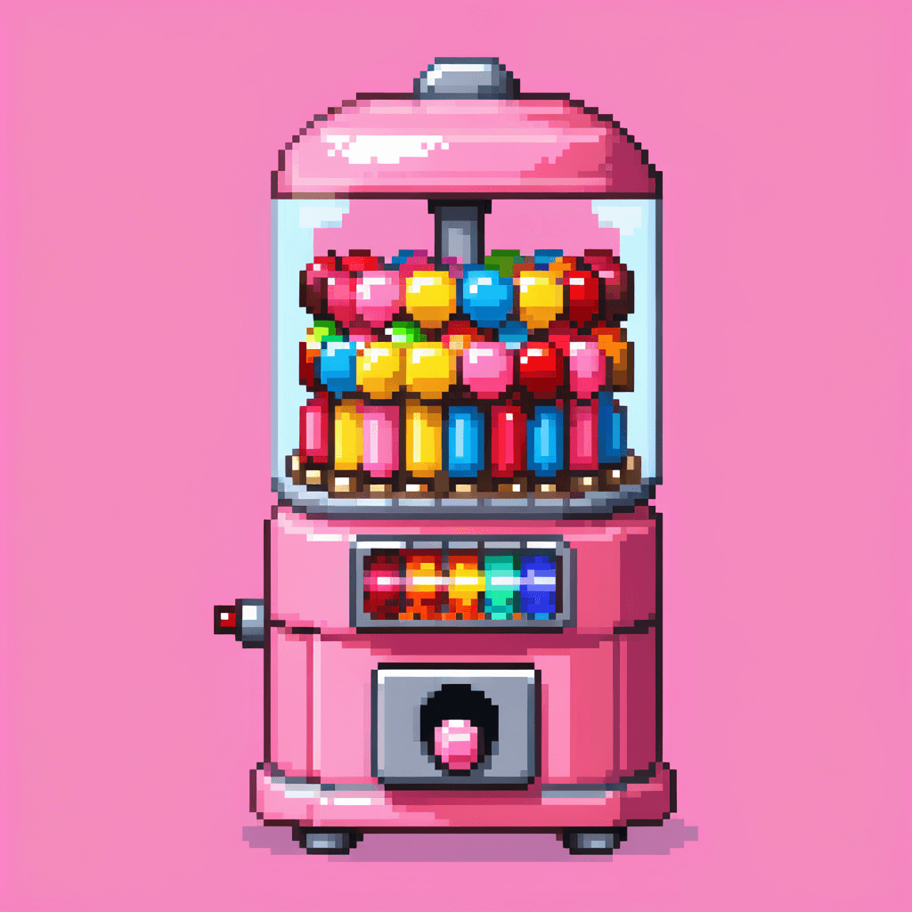

### Candy Machine.

<div style="max-width: 200px;">
  
</div>

A better image tagger for creating LORAs.

## Requirements:

- Python 3

## Running Image Tagger on GPU

Requires CUDA 12.2 and cuDNN8.x.

```
[activate venv]
pip install onnxruntime-gpu --extra-index-url https://aiinfra.pkgs.visualstudio.com/PublicPackages/_packaging/onnxruntime-cuda-12/pypi/simple/
```

## Run Locally (Windows)

```sh
cd candy-machine
run
```

## Run Locally (MacOS/Unix)

```sh
cd candy-machine
chmod +x dev.sh
./dev.sh
```

## Feature List (Target Initial Release):

- Import directory: convert files to .png and copy files to working directory, rename to 0001.jpg etc.
- Global: Pre-built categories but you can modify them youself, including re-arranging the order, etc.
- Project: Select which categories to include, and which tags to add by default (i.e. photography).
- Project: Set min and max tags per category.
- Only show tags with > N uses, otherwise hide under a ... tag.
- Sort tags by frequency.
- Quick tag add box.
- Keyboard shortcuts.
- Crop image.
- Warning if image too small.
- % done
- Export wizard with .json of suggested settings for LORA.

Roadmap:

- Have saved presets (i.e. photography, anime, style LORAs etc)
- Watermark removal (inpainting via A1111?)

Technical Notes:

- Python server to do things like moving image, resizing etc - using virtual env.
- Parcel
- Flowbite React
- Tailwind CSS
